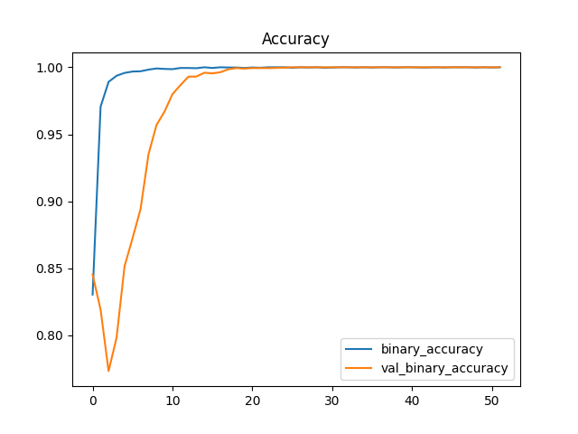

# Solution
## Overview
Binary classification provides an yes/no output given the dataset. The approach to binary classification can be derived from regression with a loss function be the objective of the training and an optimizer. The loss function in binary classification should change smoothly; therefore, cross-entropy would be a good choice based on [Kaggle tutorial](https://www.kaggle.com/ryanholbrook/binary-classification). The cross-entropy penalizes incorrect prediction by giving a high loss value.
The target of the network needs to be channelled to either 0 or 1 in binary classification. So, Sigmoid function would be used as the last activation function. In addition, using a threshold probability=0.5 will divide the result groups into either 0's or 1's.
The given dataset contains strings for each category, so we must transform those columns into numeric values for regression to work. Using the `LabelEncoder` from scikit would do the job as we reconstruct each column.
The given dataset also has strings for the classe names. Converting e(edible) and p(poisonous) into 0 and 1 makes the training of network happen.
70% of sample data is used for training.

## Model & Training
Dense layers of network are used in the model with batch normalization occurs between each layer. Dropout(=30%) is also applied in the model to correct overfitting if noises exist. Early stopping is also applied to prevent overfitting using delta=0.001 and restore_best_weights.

## Results
By using early stopping, we are able to get the results before running the predefined number of epochs. The best validation loss gives 0.00004 and the best validation accuracy gives 1.00000 as the best weights are restored. In the loss graph, it can be interpreted that the shrinking gap between losses indicates a effective training of model. The accuracy graph indicates a consistent line-fitting after some training.

